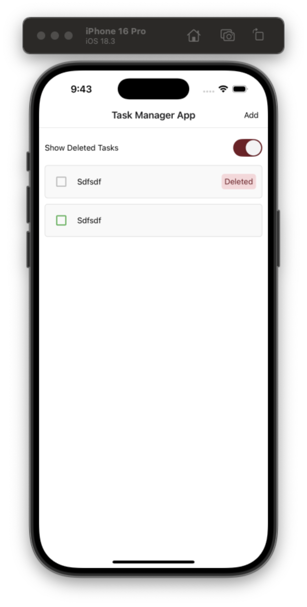
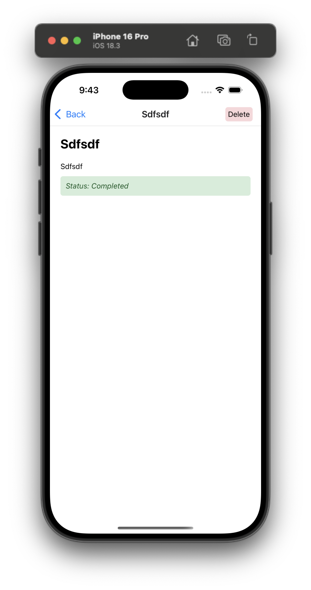
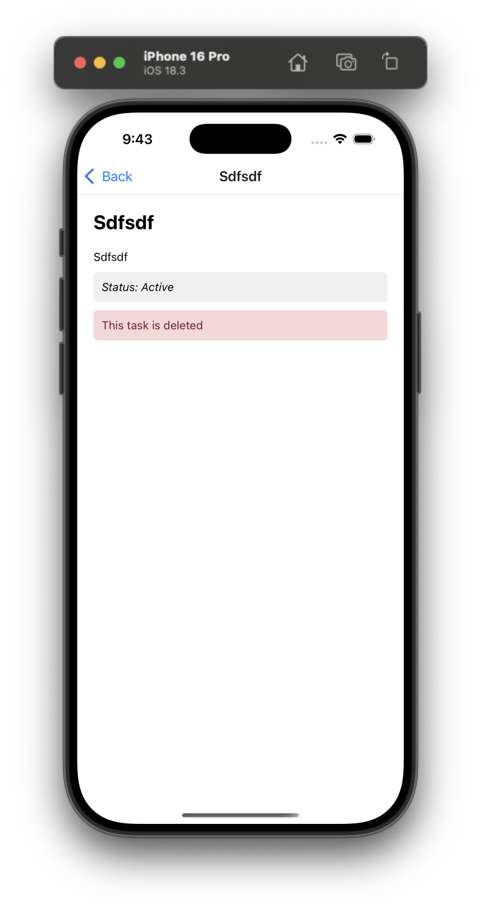
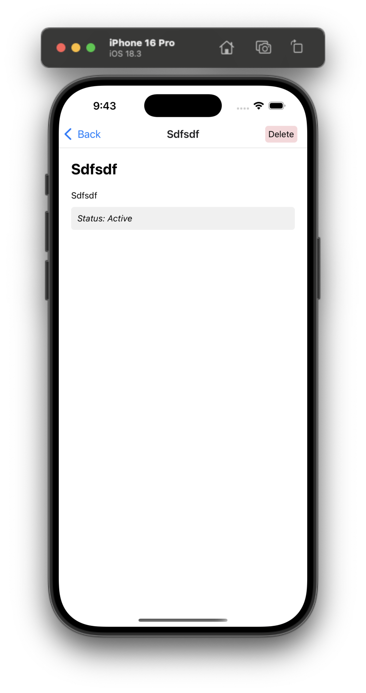
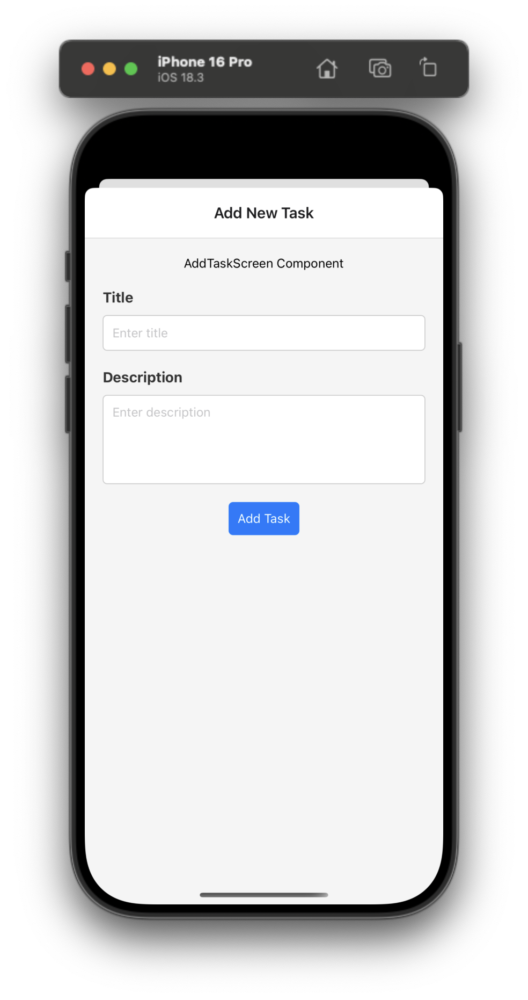
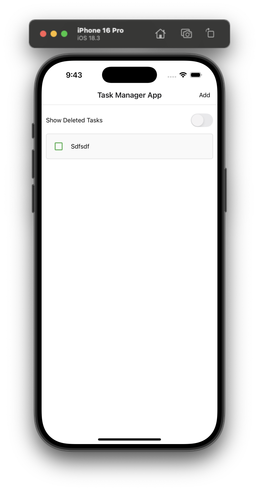

# Task Manager App

A mobile task management application built with React Native and Expo, allowing users to efficiently manage their daily tasks with a clean and intuitive interface.

## 📱 Screenshots








_DetailTask Screen showing task completion status and navigation_

## 📋 Description

Develop a basic Task Manager app using React Native. This app allows users to add tasks, mark them as complete, and delete them. The primary focus is on frontend development, user interaction, and state management within the app.

## 🎯 Objectives

The Task Manager app provides the following core functionality:

- **Add Task**: Users can add a new task with a brief description
- **Mark Task as Complete**: Users can mark tasks as complete, which visually distinguishes them from incomplete tasks
- **Delete Task**: Users can delete a task from the list
- **Task List**: Display all tasks in a list view, showing both complete and incomplete tasks

## ✨ Features

### Core Features

- ✅ **Task Creation** - Add new tasks with title and description
- ✅ **Task Completion** - Toggle task completion status with visual feedback
- ✅ **Task Details** - View detailed task information in a modal presentation
- ✅ **Task List** - Organized list view with completion status indicators
- ✅ **Navigation** - Smooth navigation between screens with proper headers

### UI/UX Features

- 📱 **Responsive Design** - Optimized for both iOS and Android
- 🎨 **Visual Status Indicators** - Color-coded completion states
- ⌨️ **Smart Keyboard Navigation** - Auto-focus between input fields
- 📝 **Text Truncation** - 2-line ellipsis for long task titles
- 🔄 **Loading States** - Visual feedback during task operations
- 📱 **Modal Presentations** - Native modal experience for detailed views

## 🚀 Getting Started

### Prerequisites

- Node.js (v14 or higher)
- npm or yarn
- Expo CLI
- iOS Simulator (for iOS development)
- Android Emulator (for Android development)

### Installation

1. **Clone the repository**

   ```bash
   git clone <repository-url>
   cd task-manager-app
   ```

2. **Install dependencies**

   ```bash
   npm install
   ```

3. **Start the development server**

   ```bash
   npx expo start
   ```

4. **Run on device/simulator**
   - Press `i` for iOS Simulator
   - Press `a` for Android Emulator
   - Scan QR code with Expo Go app for physical device

## 🏗️ Project Structure

```
task-manager-app/
├── App.tsx                 # Main app component with navigation
├── src/
│   ├── components/         # Reusable UI components
│   │   ├── Button/         # Custom button component
│   │   ├── InputField/     # Text input with focus navigation
│   │   ├── ItemListRenderer/ # Task item display component
│   │   └── FlatListRenderer/ # List rendering component
│   ├── screens/           # App screens
│   │   ├── HomeScreen/    # Main task list screen
│   │   ├── AddTaskScreen/ # Task creation screen (modal)
│   │   └── DetailTaskScreen/ # Task detail view (modal)
│   ├── constants/         # App constants and labels
│   ├── types/            # TypeScript type definitions
│   └── utils/            # Utility functions
├── assets/               # Images and static assets
└── README.md            # Project documentation
```

## 🛠️ Technologies Used

- **React Native** - Mobile app framework
- **Expo** - Development platform and tools
- **TypeScript** - Type-safe JavaScript
- **React Navigation** - Navigation library
- **React Native Safe Area Context** - Safe area handling
- **React Native Bouncy Checkbox** - Interactive checkboxes

## 📦 Dependencies

### Core Dependencies

```json
{
  "@react-navigation/native": "^6.x.x",
  "@react-navigation/native-stack": "^6.x.x",
  "react-native-safe-area-context": "^4.x.x",
  "react-native-screens": "^3.x.x",
  "@futurejj/react-native-checkbox": "^1.x.x"
}
```

### Development Dependencies

```json
{
  "typescript": "^5.x.x",
  "@types/react": "^18.x.x",
  "@types/react-native": "^0.x.x"
}
```

## 📱 App Flow

1. **Home Screen** - Displays list of all tasks with completion status
2. **Add Task** - Modal screen for creating new tasks
3. **Task Details** - Modal screen showing task information
4. **Task Management** - Toggle completion and delete functionality

## 🎨 UI Components

### Task Item

- Checkbox for completion toggle
- Title with 2-line truncation
- Visual completion indicators
- Tap to view details

### Input Fields

- Auto-focus navigation between fields
- Keyboard return key handling
- Multiline support for descriptions

### Navigation

- Stack navigation with modals
- Custom header buttons
- Safe area handling

## 🔧 Configuration

### Navigation Stack

```typescript
type RootStackParamList = {
  Home: undefined;
  AddTask: undefined;
  DetailTask: { taskId?: number };
};
```

### Task Data Structure

```typescript
interface TaskItem {
  id: number;
  title: string;
  description: string;
  isCompleted: boolean;
  isDeleted: boolean;
}
```

## 📝 Usage Examples

### Adding a Task

1. Tap "Add" button in header
2. Enter task title and description
3. Press "Add Task" to save

### Marking Complete

1. Tap checkbox next to any task
2. Visual feedback shows completion status
3. Task styling updates automatically

### Viewing Details

1. Tap on any task item
2. Modal opens with full task details
3. Use "Back" button to return

## 🚧 Development Notes

### State Management

- Basic useState for task management
- For production apps, consider Redux with Saga or Context API

### ID Generation

- Simple timestamp + random number approach
- For production, consider UUID or backend-generated IDs

### Performance

- FlatList for efficient task rendering
- Optimized re-renders with proper key props

## 🤝 Contributing

1. Fork the repository
2. Create your feature branch (`git checkout -b feature/AmazingFeature`)
3. Commit your changes (`git commit -m 'Add some AmazingFeature'`)
4. Push to the branch (`git push origin feature/AmazingFeature`)
5. Open a Pull Request

## 📄 License

This project is licensed under the MIT License - see the [LICENSE.md](LICENSE.md) file for details.

## 🔮 Future Enhancements

- [ ] Task categories and tags
- [ ] Due dates and reminders
- [ ] Search and filter functionality
- [ ] Data persistence (AsyncStorage/SQLite)
- [ ] User authentication
- [ ] Cloud synchronization
- [ ] Task priority levels
- [ ] Dark mode support

## 🐛 Known Issues

- Android status bar overlay (resolved with SafeAreaProvider)
- Focus navigation between input fields (implemented)
- Task completion state management (optimized)

## 📞 Support

For support, email your-email@example.com or create an issue in the repository.

---

**Built with ❤️ using React Native and Expo**
